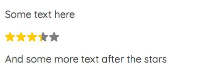
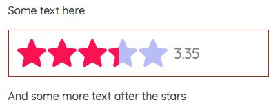

# React Star Rating

## What is this

A simple [React](https://reactjs.com/) component that shows a rating from 0 to 5 with svg stars. Just need to pass a number. No dependencies required.

## Installation

As with any other node package in React, Gatsby, Next.js, etc.:

```bash
npm i @rubenvara/react-star-rating
```

## Usage

The package exports a React component.

The component takes a number of props:

| Prop   | Type   | Default | Required | Description                                           |
| ------ | ------ | ------- | -------- | ----------------------------------------------------- |
| rating | Number | -       | Yes      | The rating. Any number from 0 to 5.0                  |
| config | Object | {}      | No       | Config options for the component. See below           |
| style  | Object | {}      | No       | CSS styles passed directly to the container component |

**About the config object**:

| Option     | Type    | Default   | Description                                     |
| ---------- | ------- | --------- | ----------------------------------------------- |
| fullColor  | String  | '#ffcf00' | The color for the filling of the stars          |
| emptyColor | String  | '#7f7f7f' | The color for the empty parts of the stars      |
| size       | Number  | 20        | The size of the stars. Pass a number of pixels. |
| showText   | Boolean | false     | Show the rating number next to the stars or not |

**About the style prop**: It accepts an object of css styles, written in camelCase to inline in JSX components. It is passed directly, unchecked, to the main `div`. Use it cautiously. Check the example below.

### Be aware

- Any css-valid color is accepted (hsl, hex, rgb, string, etc.).
- Stars are 1:1 proportionate (width equals height, so both equal the size property).
- If the rating number is shown (when `config.showText = true`), font size is half the star size or 16px, whichever is higher.

### Example

Use it as follows:

#### Simple

```js
import StarRating from '@rubenvara/react-star-rating';

// ...

return <StarRating rating={3.35} />;

// ...
```

Output:



#### More advanced

```js
import StarRating from '@rubenvara/react-star-rating';

// ...

const rating = 3.35;
const config = {
  fullColor: '#f05',
  emptyColor: 'hsl(240, 80%, 85%)',
  size: 42,
  showText: true,
};
const style = {border: `1px solid`, borderColor: `firebrick`, padding: 12};

// ...

return <StarRating rating={rating} config={config} style={style} />;

//...
```

Output:



### Be careful

- Passing a rating higher than 5.0 or lower than 0.0 will break the component.

## Future?

- [ ] Write tests.
- [ ] Check the user input rating and return an error or something more usefull than just breaking the thing.
- [ ] Improve styling of the rating number.
